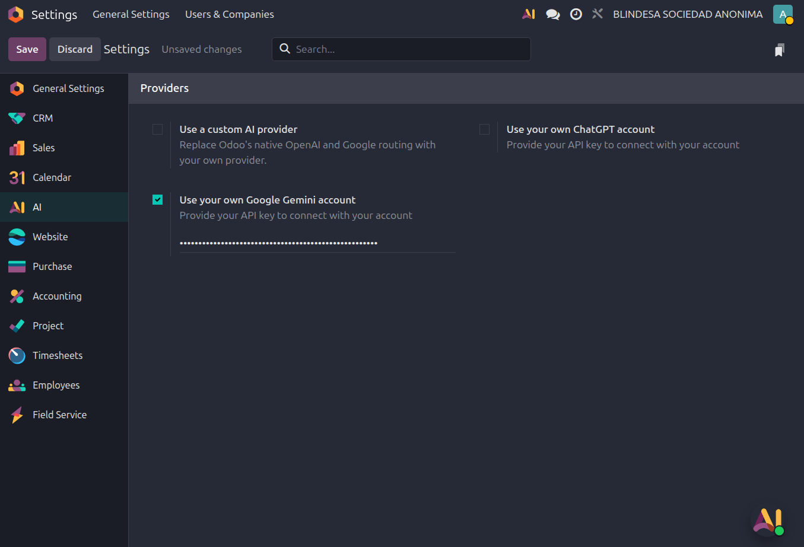
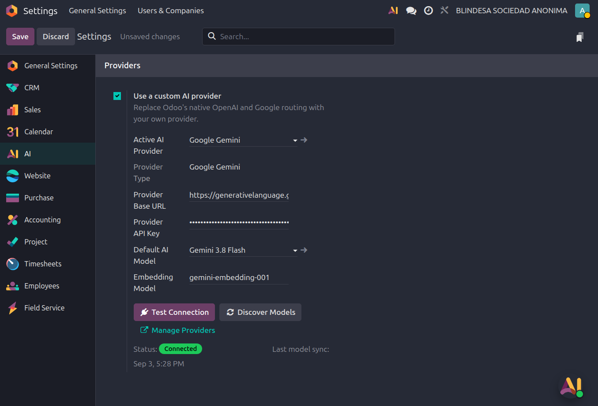

# Odoo 19 AI Custom Provider

[](https://www.odoo.com/documentation/19.0/)
[](LICENSE)
[](#development-and-tests)

Use OpenAI-compatible APIs, Anthropic, Google Gemini, Ollama, Groq,
OpenRouter, or DeepSeek directly from Odoo 19's native AI settings and agents.

This addon does **not** create a separate AI application or replace Odoo's AI
user experience. It keeps Odoo's native agents, Discuss integration, tools, RAG,
and AI settings, while routing model requests through the provider you choose.

> [!IMPORTANT]
> This addon requires **Odoo 19 Enterprise** and the native `ai` and `ai_app`
> addons. The addon itself is open source under LGPL-3.0, but Odoo Enterprise
> requires a valid Odoo Enterprise subscription. Odoo Online does not support
> custom addons.

## What it looks like

Odoo's standard AI provider settings:



The same native settings page after enabling a custom provider:



## Features

- Configuration inside **AI > Configuration > Settings > Providers**.
- Global replacement of Odoo's native OpenAI and Google chat routing.
- A required default model prevents native model names from being sent to an
  incompatible custom endpoint.
- Custom models in the native `ai.agent` **LLM Model** selector.
- Live connection tests and model discovery.
- Native Odoo tool-calling loop with provider-specific message conversion.
- Structured JSON responses and image inputs where supported by the provider.
- RAG embeddings through OpenAI-compatible, Gemini, and Ollama endpoints.
- Request diagnostics, token counts, latency, and estimated cost logs.
- Migration from the module's earlier direct-model configuration.

## Supported providers

| Provider type | Example base URL | Chat | Tools | Embeddings |
|---|---|:---:|:---:|:---:|
| OpenAI | `https://api.openai.com/v1` | Yes | Yes | Yes |
| OpenAI-compatible | `https://llm.example.com/v1` | Yes | Depends on server | Usually |
| Anthropic | `https://api.anthropic.com/v1` | Yes | Yes | No |
| Google Gemini | `https://generativelanguage.googleapis.com/v1beta` | Yes | Yes | Yes |
| Ollama | `http://localhost:11434` | Yes | Model-dependent | Yes |
| Groq | `https://api.groq.com/openai/v1` | Yes | Model-dependent | Provider-dependent |
| OpenRouter | `https://openrouter.ai/api/v1` | Yes | Model-dependent | Provider-dependent |
| DeepSeek | `https://api.deepseek.com/v1` | Yes | Model-dependent | Provider-dependent |

Provider capabilities also depend on the selected model and API account.

## Requirements

- Odoo 19 Enterprise.
- The Enterprise add-ons path available to Odoo.
- Native Odoo addons `ai` and `ai_app` installed or installable.
- PostgreSQL configured for the Odoo instance.
- Network access from the Odoo process/container to the selected API endpoint.
- An API key when required by the provider.

The addon directory must be named exactly:

```text
odoo_custom_llm_provider
```

Hyphens in the directory name prevent Odoo from importing the Python package.

## Installation

Choose the method that matches your Odoo deployment.

### Option 1: Docker Compose

Using a bind mount is strongly recommended. Files copied only into a running
container disappear when that container is recreated.

Clone the addon on the Docker host:

```bash
sudo mkdir -p /opt/odoo/addons
sudo git clone \
  https://github.com/Rubencsku/odoo_custom_llm_provider.git \
  /opt/odoo/addons/odoo_custom_llm_provider
```

Mount the host add-ons directory in `compose.yml`. The official Odoo image uses
`/mnt/extra-addons` by default:

```yaml
services:
  odoo:
    image: odoo:19.0
    volumes:
      - /opt/odoo/addons:/mnt/extra-addons
```

If your custom image uses `/opt/odoo/addons` inside the container, this is also
valid, provided that path is included in `addons_path`:

```yaml
services:
  odoo:
    volumes:
      - /opt/odoo/addons:/opt/odoo/addons
```

Check that the service can see the manifest:

```bash
sudo docker compose exec odoo \
  test -f /mnt/extra-addons/odoo_custom_llm_provider/__manifest__.py
```

For a custom `/opt/odoo/addons` mount, replace `/mnt/extra-addons` in that check.

Install the addon into a database. Replace `odoo`, `YOUR_DATABASE`, and the
configuration path when your Compose project uses different values:

```bash
sudo docker compose stop odoo

sudo docker compose run --rm --no-deps odoo \
  odoo -c /etc/odoo/odoo.conf \
  -d YOUR_DATABASE \
  -i odoo_custom_llm_provider \
  --stop-after-init \
  --no-http

sudo docker compose up -d odoo
sudo docker compose logs --tail=150 odoo
```

You can also install it from Odoo's Apps screen after restarting the container:
enable developer mode, update the Apps list, remove the default **Apps** filter,
search for **Odoo AI Custom Provider**, and select **Install**.

### Option 2: Odoo installed from source

Clone the addon into a custom add-ons directory:

```bash
mkdir -p /opt/odoo/custom-addons
git clone \
  https://github.com/Rubencsku/odoo_custom_llm_provider.git \
  /opt/odoo/custom-addons/odoo_custom_llm_provider
```

Add the directory to `addons_path`. For Enterprise installations, Odoo
recommends putting the Enterprise add-ons path before the other paths:

```ini
[options]
addons_path = /opt/odoo/enterprise,/opt/odoo/odoo/addons,/opt/odoo/custom-addons
```

Install the module:

```bash
cd /opt/odoo/odoo
python3 odoo-bin \
  -c /etc/odoo.conf \
  -d YOUR_DATABASE \
  -i odoo_custom_llm_provider \
  --stop-after-init \
  --no-http
```

Start Odoo again using the same configuration file and normal process manager.

### Option 3: Debian, Ubuntu, or RPM package installation

Create a directory for custom addons and clone the repository:

```bash
sudo mkdir -p /opt/odoo/custom-addons
sudo git clone \
  https://github.com/Rubencsku/odoo_custom_llm_provider.git \
  /opt/odoo/custom-addons/odoo_custom_llm_provider
sudo chmod -R a+rX /opt/odoo/custom-addons/odoo_custom_llm_provider
```

Add `/opt/odoo/custom-addons` to `addons_path` in the Odoo configuration file.
Package installations commonly use `/etc/odoo.conf`; some distributions use
`/etc/odoo/odoo.conf`.

Then stop the service, install the module, and start the service again:

```bash
sudo systemctl stop odoo

sudo -u odoo /usr/bin/odoo \
  -c /etc/odoo.conf \
  -d YOUR_DATABASE \
  -i odoo_custom_llm_provider \
  --stop-after-init \
  --no-http

sudo systemctl start odoo
sudo journalctl -u odoo -n 150 --no-pager
```

Adjust the service name, executable, configuration path, and Odoo system user to
match your package.

### Option 4: Odoo.sh

Odoo.sh detects custom addon directories committed to the connected GitHub
repository. Either copy this addon into your Odoo.sh repository or add it as a
Git submodule:

```bash
git submodule add \
  https://github.com/Rubencsku/odoo_custom_llm_provider.git \
  custom-addons/odoo_custom_llm_provider
git commit -m "Add Odoo AI custom provider"
git push
```

After the Odoo.sh build completes, update the Apps list and install **Odoo AI
Custom Provider** in the target database. Test on a development or staging branch
before merging into production.

## Configuration

1. Open **AI > Configuration > Settings**.
2. Enable **Use a custom AI provider**.
3. Select an existing provider or create one through **Manage Providers**.
4. Set the provider type, base URL, API key, and timeout.
5. Select **Test Connection**.
6. Select **Discover Models**.
7. Choose the **Default AI Model**.
8. Configure an **Embedding Model** if Odoo agents will use sources/RAG.
9. Save the settings.
10. Open **AI > Agents**, choose a native or custom model, and use **Test**.

When the global custom-provider option is enabled, native OpenAI and Google chat
requests use the selected default custom model. An agent that explicitly selects
a custom model continues to use that model's own provider.

### Recommended provider values

| Provider | Provider type | Default embedding model |
|---|---|---|
| OpenAI | `OpenAI` | `text-embedding-3-small` |
| Gemini | `Google Gemini` | `gemini-embedding-001` |
| Ollama | `Ollama` | An installed embedding model such as `nomic-embed-text` |
| Anthropic | `Anthropic Claude` | Not supported by Anthropic |
| Groq/OpenRouter/DeepSeek | Matching provider type | Depends on the endpoint |

For RAG, the embedding endpoint must return vectors for every input. Odoo 19
stores 1536-dimensional vectors; this addon pads shorter vectors with zeros and
truncates larger vectors so they fit Odoo's native vector field.

## Updating an existing installation

Always back up the database and filestore before updating production.

Pull the latest code:

```bash
git -C /opt/odoo/addons/odoo_custom_llm_provider pull --ff-only
```

Use `-u` instead of `-i` to run the module update and its migrations.

Docker Compose:

```bash
sudo docker compose stop odoo

sudo docker compose run --rm --no-deps odoo \
  odoo -c /etc/odoo/odoo.conf \
  -d YOUR_DATABASE \
  -u odoo_custom_llm_provider \
  --stop-after-init \
  --no-http

sudo docker compose up -d odoo
```

Source installation:

```bash
python3 odoo-bin \
  -c /etc/odoo.conf \
  -d YOUR_DATABASE \
  -u odoo_custom_llm_provider \
  --stop-after-init \
  --no-http
```

Package installation:

```bash
sudo systemctl stop odoo
sudo -u odoo /usr/bin/odoo \
  -c /etc/odoo.conf \
  -d YOUR_DATABASE \
  -u odoo_custom_llm_provider \
  --stop-after-init \
  --no-http
sudo systemctl start odoo
```

After upgrading from versions earlier than `19.0.2.0.0`, verify the **Default AI
Model** in native AI settings. The included migration selects the first active
chat model for providers that did not already have a default.

## Troubleshooting

### The addon does not appear in Apps

- Confirm the directory is named `odoo_custom_llm_provider`.
- Confirm its parent directory is present in `addons_path`.
- Restart Odoo after adding or changing Python files.
- Enable developer mode and update the Apps list.
- Remove the default **Apps** search filter because this addon has
  `application = False`.

### Odoo reports that `ai` or `ai_app` is missing

This addon requires Odoo 19 Enterprise. Confirm that the Enterprise repository
or package is installed and that its add-ons directory is in `addons_path`.

### Settings or model fields did not change after pulling new code

Restart Odoo and run a module update with:

```bash
-u odoo_custom_llm_provider --stop-after-init
```

Restarting alone reloads Python but does not apply XML views, schema changes, or
migration scripts.

### Connection succeeds but an agent fails

- Verify **Default AI Model** belongs to **Active AI Provider**.
- Check that the model supports chat and, when required, tools or images.
- For Docker, remember that `localhost` means the Odoo container itself. Use the
  Ollama Compose service name, `host.docker.internal`, or a reachable host IP.
- Review Odoo logs and the addon's request diagnostics.

### RAG/source indexing fails

- Configure a real embedding model available through the active provider.
- Anthropic does not provide an embeddings API.
- Confirm the provider returns one vector per input text.
- Reprocess the agent sources after changing the embedding model.

## Security notes

- Provider keys are administrator-only fields but are stored in the Odoo
  database. Protect database dumps and backups accordingly.
- Never commit API keys, `.env` files, database dumps, or production logs.
- Use HTTPS for remote provider endpoints.
- Restrict access to **Manage Providers** to trusted administrators.
- Test new endpoints and models in a non-production database first.

## Development and tests

The adapter tests run without a complete Odoo server:

```bash
python3 -m unittest discover -s tests -p "test_*.py" -v
```

For integration testing, update the addon in an Odoo 19 Enterprise test database
and test:

1. A native model while global custom routing is enabled.
2. A custom model selected directly on an AI agent.
3. A tool-enabled agent.
4. An agent with an indexed source/RAG.

## Contributing

Bug reports and pull requests are welcome. When reporting a problem, include:

- Odoo 19 build/date and deployment method.
- Provider type and model name, without API keys.
- Relevant Odoo log output with secrets removed.
- Steps that reproduce the issue.

Please add or update tests for behavior changes and keep provider-specific logic
inside `services/` whenever possible.

## License

Copyright © Ruben Oviedo and contributors.

Licensed under the [GNU Lesser General Public License v3.0](LICENSE), consistent
with the `LGPL-3` license declared in the Odoo addon manifest.

## References

- [Odoo 19 source installation](https://www.odoo.com/documentation/19.0/administration/on_premise/source.html)
- [Odoo 19 packaged installers](https://www.odoo.com/documentation/19.0/administration/on_premise/packages.html)
- [Odoo 19 on-premise update guide](https://www.odoo.com/documentation/19.0/administration/on_premise/update.html)
- [Official Odoo Docker image](https://hub.docker.com/_/odoo)
- [Odoo.sh: adding custom modules](https://www.odoo.com/documentation/19.0/administration/odoo_sh/getting_started/create.html#push-modules-in-production)
